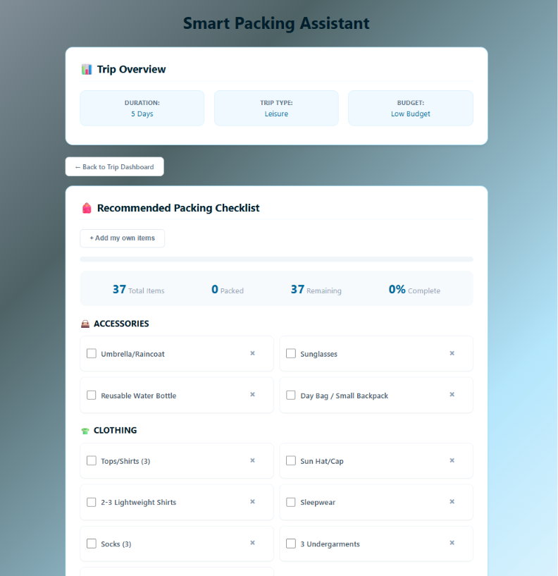
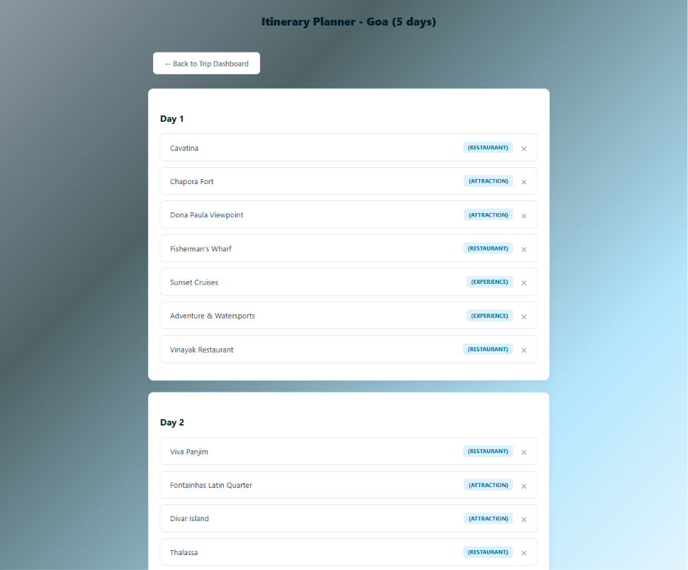

# TripOps

TripOps is a full-stack travel planning and management web application developed using HTML, CSS, JavaScript, PHP, and MySQL.

It helps users plan trips, manage group travel, split expenses, generate itineraries, and create smart packing lists with a smooth and interactive UI.

---

## Features

- User Authentication (Signup/Login/Profile)
- Destination Discovery System
- Group Trip Creation with Invite Codes
- Expense Splitting & Budget Management
- Real-time Group Chat
- Smart Packing Assistant (rule-based system)
- Automatic Itinerary Generator
- Weather API Integration
- PDF Itinerary Export
- Booking Simulation System
- Responsive UI for all devices

---

## Tech Stack

**Frontend:**
- HTML
- CSS
- JavaScript

**Backend:**
- PHP
- MySQL

**APIs & Libraries:**
- OpenWeatherMap API
- Leaflet.js (Maps)
- jsPDF (PDF generation)

**Environment:**
- XAMPP (Local Server)

---

## Setup Instructions

1. Install XAMPP
2. Start Apache and MySQL
3. Import `tripops_db.sql` into phpMyAdmin
4. Place project folder inside `htdocs`
5. Run in browser:
   ```
   http://localhost/your-folder-name/landing.php
   ```

---

## Screenshots

### Home Page


### Destination Page


### Trip Dashboard


### Smart Packing Assistant


### Itinerary Generator


---


## Demo Video

Watch the full project demo here:

https://drive.google.com/file/d/1zbk2t1FakqsIbJHCTpUkjVHnpaiMz790/view?usp=sharing

---

## Security Features

- Password hashing using bcrypt
- Prepared SQL statements (SQL Injection protection)
- Session-based authentication
- Input sanitization using PHP functions
- Protected API key using environment variables (.env)

---

## API Used

- OpenWeatherMap API → Live weather data
- Amadeus API → Flight search and airport autocomplete

---

## Future Improvements

- Real payment gateway integration
- AI-based travel recommendations
- Mobile app version
- Live chat using WebSockets
- Google Maps integration

---

## Author

Harsha

```
